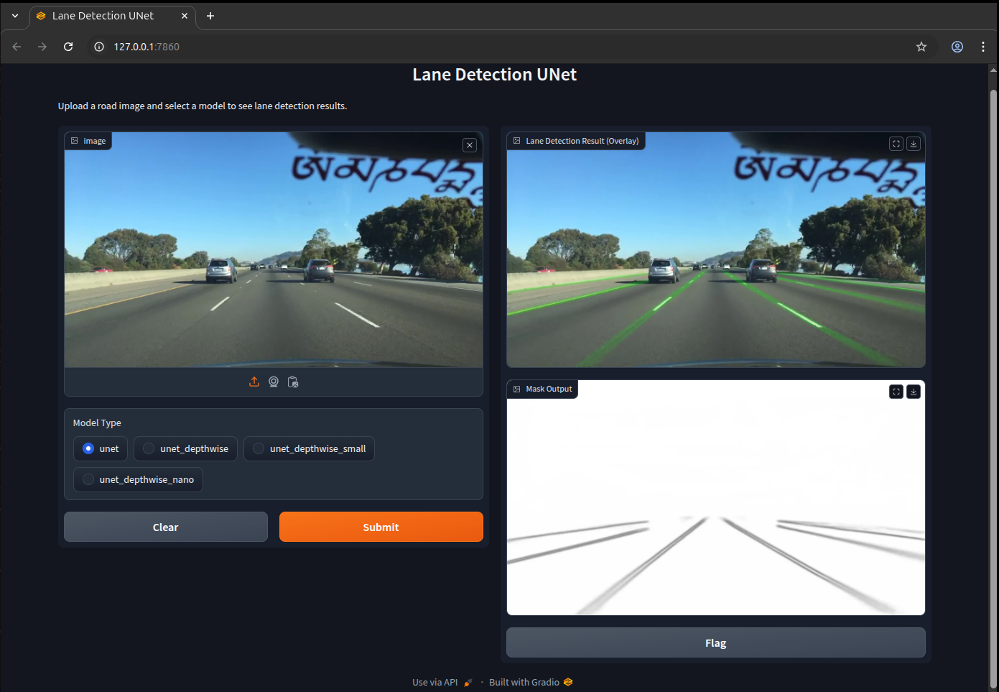

# UNet Lane Segmentation & NCNN Deployment

https://github.com/user-attachments/assets/8374a74f-d099-4abe-b271-90367a35c47b

This repository provides a pipeline for lane segmentation using a UNet model trained on the BDD100K dataset. It includes modular scripts for training, validation, and inference, with configuration-driven workflows and TensorBoard logging. The project supports exporting PyTorch models for deployment with the NCNN framework, enabling efficient inference on ARM and x86 platforms via C++.

## Features
- UNet architecture for lane segmentation
- BDD100K dataset integration
- Configurable training and inference scripts
- Checkpointing and metrics
- TensorBoard support
- Model export for NCNN (TorchScript → pnnx → NCNN)
- C++ deployment example with NCNN and OpenCV

---

## Table of Contents
- [Overview](#unet-lane-segmentation--ncnn-deployment)
- [Setup Instructions](#setup-instructions)
- [Dataset](#dataset)
- [Pretrained Models on Hugging Face](#pretrained-models-on-hugging-face)
- [Training Usage](#training-usage)
- [Inference Usage](#inference-usage)
- [Exporting Model for NCNN Deployment](#exporting-model-for-ncnn-deployment)
- [NCNN Library Setup](#ncnn-library-setup)
- [NCNN C++ Deployment](#ncnn-c-deployment)
- [Gradio Lane Detection Demo](#gradio-lane-detection-demo)
- [Results Comparison](#results-comparison)
- [Codebase Directory Tree](#codebase-directory-tree)
- [Citation](#citation)

---

## Setup Instructions

### 1. Quick Start (Docker)
```bash
docker run -it --gpus all --shm-size=16g -v /home:/home <image_id>
```

### 2. Environment Setup
```bash
apt update && apt upgrade -y
apt install python3 python3-pip -y
apt install build-essential git cmake wget libprotobuf-dev protobuf-compiler libomp-dev libopencv-dev -y
```

### 3. PyTorch Installation
```bash
pip install torch==1.13.1+cu117 torchvision==0.14.1+cu117 --extra-index-url https://download.pytorch.org/whl/cu117
pip install -r requirements.txt
```

---

## Dataset

### BDD100K
BDD100K is a large-scale driving video dataset for diverse road scenes, widely used for autonomous driving research. This project uses the lane segmentation subset, which provides pixel-level lane annotations for training semantic segmentation models.

#### Download & Preparation
- Official website: https://bdd-data.berkeley.edu/
- Download the images and lane mask annotations from the BDD100K website or via their download scripts.
- Organize the dataset as follows:

```
bdd100k/
├── images/
│   └── 100k/
│       ├── train/
│       ├── val/
│       └── test/
└── lane/
  ├── colormaps/
  ├── masks/
  │   ├── train/
  │   └── val/
  └── polygons/
```
- `images/100k/train`, `val`, and `test` contain the raw images.
- `lane/masks/train` and `val` contain binary lane segmentation masks.
- `lane/colormaps` and `lane/polygons` provide additional annotation formats.

---

## Pretrained Models on Hugging Face

Pretrained weights for all UNet variants are available on Hugging Face:

| Model                | PyTorch (.pt)         | NCNN (.param, .bin)         | Repo Link |
|----------------------|----------------------|-----------------------------|-----------|
| UNet                 | [pt](https://huggingface.co/nickpai/lane-detection-unet-ncnn/blob/main/unet/unet_best.pt) | [param](https://huggingface.co/nickpai/lane-detection-unet-ncnn/blob/main/unet/unet_jit.ncnn.param), [bin](https://huggingface.co/nickpai/lane-detection-unet-ncnn/blob/main/unet/unet_jit.ncnn.bin) | [repo](https://huggingface.co/nickpai/lane-detection-unet-ncnn/tree/main/unet) |
| UNetDepthwise        | [pt](https://huggingface.co/nickpai/lane-detection-unet-ncnn/blob/main/unet_depthwise/unet_depthwise_best.pt) | [param](https://huggingface.co/nickpai/lane-detection-unet-ncnn/blob/main/unet_depthwise/unet_depthwise_jit.ncnn.param), [bin](https://huggingface.co/nickpai/lane-detection-unet-ncnn/blob/main/unet_depthwise/unet_depthwise_jit.ncnn.bin) | [repo](https://huggingface.co/nickpai/lane-detection-unet-ncnn/tree/main/unet_depthwise) |
| UNetDepthwiseSmall   | [pt](https://huggingface.co/nickpai/lane-detection-unet-ncnn/blob/main/unet_depthwise_small/unet_depthwise_small_best.pt) | [param](https://huggingface.co/nickpai/lane-detection-unet-ncnn/blob/main/unet_depthwise_small/unet_depthwise_small_jit.ncnn.param), [bin](https://huggingface.co/nickpai/lane-detection-unet-ncnn/blob/main/unet_depthwise_small/unet_depthwise_small_jit.ncnn.bin) | [repo](https://huggingface.co/nickpai/lane-detection-unet-ncnn/tree/main/unet_depthwise_small) |
| UNetDepthwiseNano    | [pt](https://huggingface.co/nickpai/lane-detection-unet-ncnn/blob/main/unet_depthwise_nano/unet_depthwise_nano_best.pt) | [param](https://huggingface.co/nickpai/lane-detection-unet-ncnn/blob/main/unet_depthwise_nano/unet_depthwise_nano_jit.ncnn.param), [bin](https://huggingface.co/nickpai/lane-detection-unet-ncnn/blob/main/unet_depthwise_nano/unet_depthwise_nano_jit.ncnn.bin) | [repo](https://huggingface.co/nickpai/lane-detection-unet-ncnn/tree/main/unet_depthwise_nano) |

Each folder contains both PyTorch (.pt) and NCNN (.param, .bin) files for direct use in Python or C++ inference workflows.

#### Usage in This Project
- Update `config/train_config.yaml` and `config/test_config.yaml` to point to your local BDD100K image and mask directories.
- The dataset loader expects images and masks to be sorted and matched by filename.

---

## Training Usage

### 1. Edit Training Config
Edit `config/train_config.yaml` to set dataset paths, batch size, epochs, learning rate, image size, and model parameters.

### 2. Run Training
```bash
python3 scripts/train.py
```
Checkpoints and logs will be saved in the `checkpoints/` and `runs/` folders.

TensorBoard logs are available in `runs/`. To view training progress:
```bash
tensorboard --logdir runs/
```

---

## Inference Usage

### 1. Edit Inference Config
Edit `config/test_config.yaml` to set the trained checkpoint, input images directory, output directory, and model parameters.

### 2. Run Inference
```bash
python3 scripts/test.py
```
Output masks will be saved in the specified output directory. Progress is shown with tqdm.

---

## Exporting Model for NCNN Deployment

### 1. Export PyTorch Model and NCNN Files
Run the export script to convert your trained UNet model to TorchScript and directly export NCNN `.param` and `.bin` files:
```bash
python export/export_to_ncnn.py
```
This will generate `unet_jit.pt`, `unet_jit.param`, and `unet_jit.bin` in the output directory specified in your config. No manual pnnx command is needed.

### 2. Deploy with NCNN
Use the generated `.param` and `.bin` files for the later NCNN C++ deployment.
Refer to [NCNN documentation](https://github.com/Tencent/ncnn/wiki) for integration details.

---

## NCNN Library Setup

To build NCNN from source:
```bash
git clone https://github.com/Tencent/ncnn.git
cd ncnn
mkdir build && cd build
cmake ..
make -j$(nproc)
make install
```

---

## NCNN C++ Deployment

### 1. Build NCNN C++ Inference Code
Go to the deployment folder:
```bash
cd ncnn_deploy
mkdir build && cd build
cmake ..
make -j$(nproc)
```
If you see errors about missing NCNN or OpenCV, make sure to set the correct paths in `CMakeLists.txt`:
```cmake
set(ncnn_DIR "/path/to/ncnn/install/lib/cmake/ncnn")
include_directories("/path/to/ncnn/install/include")
```

### 2. Run Inference (Flexible CLI)
You can now run the C++ inference with flexible command-line options:
```bash
./unet_ncnn key=value ...
```
Supported keys (all optional, defaults shown):
```
input_image=/path/to/image.jpg
model_param=../../checkpoints/exp_20250907_172056/ncnn_models/unet_jit.ncnn.param
model_bin=../../checkpoints/exp_20250907_172056/ncnn_models/unet_jit.ncnn.bin
output_mask=mask.jpg
output_overlay=overlay.jpg
input_w=256
input_h=256
input_layer=in0
output_layer=out0
mask_alpha=0.8
```
Example:
```bash
./unet_ncnn input_image=img.jpg mask_alpha=0.5 output_mask=mask.png output_overlay=overlay.png
```
This will save the output mask and overlay images to the specified paths.

### 3. Output Files
- `output_mask` (default: mask.jpg): Lane mask image
- `output_overlay` (default: overlay.jpg): Lane overlay visualization

### 4. Troubleshooting
- If CMake cannot find protobuf, try:
  ```bash
  cmake .. -DProtobuf_INCLUDE_DIR=/usr/include -DProtobuf_LIBRARIES=/usr/lib/x86_64-linux-gnu/libprotobuf.so
  ```
- If CMake cannot find NCNN, set `ncnn_DIR` to the folder containing `ncnnConfig.cmake`.
- For ARM cross-compilation, set toolchain and paths as needed.

---

## Gradio Lane Detection Demo

You can try the lane detection models interactively in your browser using Gradio:

- **Hugging Face Space:** [Lane Detection UNet Demo](https://huggingface.co/spaces/nickpai/lane-detection-unet)



### Local Usage

To run the Gradio app locally:

```bash
pip install -r requirements.txt
python3 gradio_app/app.py
```

- Upload a road image and select a model type (UNet, UNetDepthwise, UNetDepthwiseSmall, UNetDepthwiseNano).
- The app will display the lane detection overlay result.

---

## Results Comparison:

https://github.com/user-attachments/assets/6a966997-c573-4b0c-b237-48ce14f6596e 

https://github.com/user-attachments/assets/caa45672-4c05-4785-adb3-775b85c3ee58   

---

## Codebase Directory Tree
```
lane-detection-unet-ncnn/
├── checkpoints
│   ├── exp_20250906_223222
│   │   ├── bdd100k_val_outputs
│   │   │   ├── config
│   │   │   └── inference_results
│   │   ├── config
│   │   │   └── train_config.yaml
│   │   ├── ncnn_models
│   │   │   ├── unet_jit.ncnn.bin
│   │   │   └── unet_jit.ncnn.param
│   │   └── weights
│   │       └── unet_best.pt
│   ├── exp_20250907_094745
|   └── ...   
├── config/
│   ├── test_config.yaml
│   └── train_config.yaml
├── datasets/
│   └── bdd100k.py
├── export/
│   └── export_to_ncnn.py
├── models/
│   ├── unet.py
│   ├── unet_depthwise.py
│   ├── unet_depthwise_small.py
│   └── unet_depthwise_nano.py
├── ncnn/
├── ncnn_deploy/
│   ├── build/
|   |   ├── input.jpg
│   |   └── unet_ncnn
│   ├── CMakeLists.txt
│   └── main.cpp
├── requirements.txt
├── runs/
├── scripts/
│   ├── test.py
│   └── train.py
├── utils/
│   ├── checkpoint.py
│   └── metrics.py
├── LICENSE
├── README.md
└── .gitignore
```

## Citation

If you use this repository or models in your research, please cite as follows:

**BibTeX:**
```
@software{Pai_UNet_Lane_Segmentation_2025,
author = {Pai, Nick},
license = {MIT},
month = sep,
title = {{UNet Lane Segmentation \& NCNN Deployment}},
url = {https://github.com/nick8592/lane-detection-unet-ncnn},
version = {1.0.0},
year = {2025}
}
```

---
